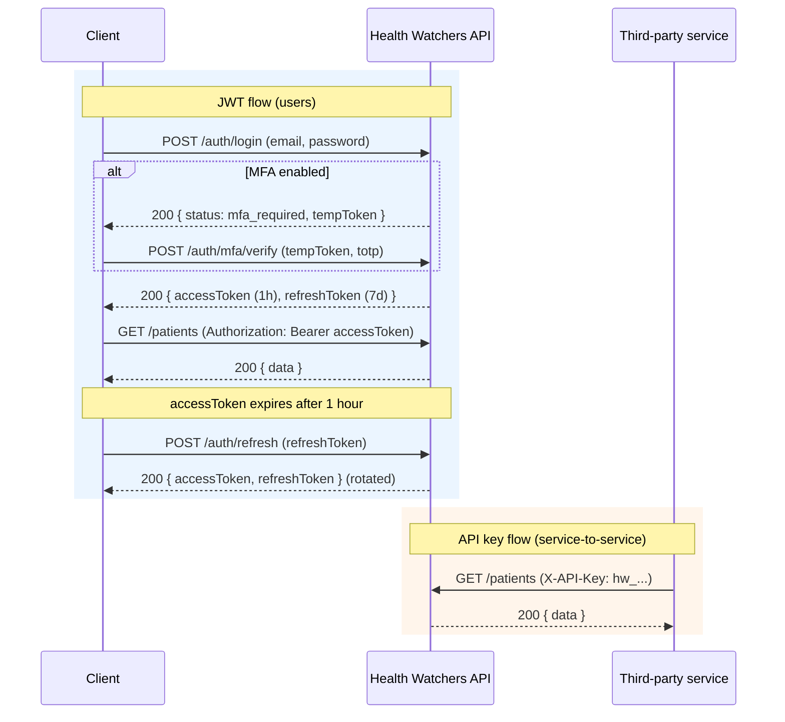

# API Documentation

> **Issues #1018** — OpenAPI/Swagger documentation for Health Watchers API.

## Overview

Health Watchers provides a comprehensive REST API for managing healthcare data, payments, and patient records. The API follows RESTful conventions and uses JSON for all request/response payloads. All endpoints enforce HIPAA compliance with end-to-end PHI encryption, role-based access control, and comprehensive audit logging.

## Table of Contents

- [Accessing API Documentation](#accessing-api-documentation)
- [Generating the OpenAPI Spec](#generating-the-openapi-spec)
- [Base URL & Versioning](#base-url--versioning)
- [Authentication](#authentication)
- [Rate Limiting](#rate-limiting)
- [Route Groups](#route-groups)
- [Request Examples](#request-examples)
- [Response Format](#response-format)
- [Pagination](#pagination)
- [Error Handling](#error-handling)
- [Webhooks](#webhooks)
- [Webhook Delivery & Retries](#webhook-delivery--retries)
- [HIPAA Compliance](#hipaa-compliance)

---

## Accessing API Documentation

### Interactive Swagger UI

Start the API server, then open the interactive docs at:

```
http://localhost:3001/api/docs
```

The Swagger UI provides:
- Complete endpoint listing with method descriptions
- Request/response schemas with examples
- Try-it-out functionality with authentication support
- Parameter documentation and validation rules
- All supported models and error responses

**Authentication in Swagger UI:**
1. Click the **Authorize** button (🔒) in the top-right of the UI
2. Enter `Bearer <your_access_token>` in the `bearerAuth` field  
   _or_ enter your API key in the `apiKeyAuth` field
3. Click **Authorize** — all subsequent requests will include the credential

### OpenAPI Specification

Download the raw OpenAPI 3.0.3 spec at:

```
http://localhost:3001/api/docs.json
```

Import this into Postman, Insomnia, or any OpenAPI-compatible tool.

A static snapshot of the spec is also committed at:

```
apps/api/docs/openapi.json
```

### Postman Collection

A ready-to-use Postman collection is in `docs/postman/`:

| File | Purpose |
|------|---------|
| `health-watchers.postman_collection.json` | All API requests with pre-request auth scripts |
| `health-watchers.postman_environment.json` | Environment variables template |

**Quick start:**
1. Import both files into Postman
2. Set `admin_email` and `admin_password` in the environment
3. Run **Auth → Login** — `jwt_token` is set automatically via the test script
4. All subsequent requests use the token via collection-level bearer auth

---

## Generating the OpenAPI Spec

The OpenAPI spec is auto-generated from JSDoc `@swagger` annotations on each controller file using `swagger-jsdoc`.

### How It Works

`apps/api/src/docs/swagger.ts` configures `swagger-jsdoc` and registers all controller files as API sources. On server start, the spec is compiled and served at `/api/docs` (Swagger UI) and `/api/docs.json` (raw JSON).

### Adding Documentation to a New Endpoint

Annotate route handlers with JSDoc blocks:

```typescript
/**
 * @swagger
 * /patients:
 *   get:
 *     summary: List patients
 *     tags: [Patients]
 *     security:
 *       - bearerAuth: []
 *     parameters:
 *       - name: page
 *         in: query
 *         schema:
 *           type: integer
 *           default: 1
 *       - name: limit
 *         in: query
 *         schema:
 *           type: integer
 *           default: 10
 *           maximum: 100
 *       - name: clinicId
 *         in: query
 *         required: true
 *         schema:
 *           type: string
 *     responses:
 *       200:
 *         description: Paginated list of patients
 *         content:
 *           application/json:
 *             schema:
 *               type: object
 *               properties:
 *                 data:
 *                   type: array
 *                   items:
 *                     $ref: '#/components/schemas/Patient'
 *                 pagination:
 *                   $ref: '#/components/schemas/PaginationMeta'
 *       401:
 *         description: Unauthorized
 *         content:
 *           application/json:
 *             schema:
 *               $ref: '#/components/schemas/Error'
 */
router.get('/patients', requireAuth, listPatients);
```

### Registering a New Controller

Add the controller file path to the `apis` array in `apps/api/src/docs/swagger.ts`:

```typescript
apis: [
  // ... existing controllers
  path.join(__dirname, '../modules/your-module/your-module.controller.ts'),
],
```

### Exporting a Static Snapshot

To regenerate `apps/api/docs/openapi.json`:

```bash
# Start the API server
npm run dev --workspace=api

# Export the spec
curl http://localhost:3001/api/docs.json -o apps/api/docs/openapi.json
```

This static file is imported by the Postman collection generator script:

```bash
node scripts/generate-postman.js
```

---

## Base URL & Versioning

```
Development:  http://localhost:3001/api/v1
Production:   https://api.healthwatchers.com/api/v1
```

Two API versions are active:

| Version | Base Path | Status | Notes |
|---------|-----------|--------|-------|
| V1 | `/api/v1` | Stable | All responses include `Deprecation: true` header |
| V2 | `/api/v2` | Expanding | New endpoints added here as they are refactored |

Use the `Accept-Version` header to negotiate, or rely on path prefixes.

```bash
# List all supported versions
GET /api/versions
```

---

## Authentication

Health Watchers uses two authentication mechanisms.

### Flow Overview



`POST /auth/login` returns `accessToken` + `refreshToken` directly for accounts without MFA. Accounts with `mfaEnabled: true` (or those still inside their MFA grace period) instead receive a short-lived `tempToken`, which is exchanged for real tokens via `POST /auth/mfa/verify` or `POST /auth/mfa/backup` (TOTP or backup code). `POST /auth/refresh` rotates the refresh token — reusing a consumed refresh token revokes its entire token family (see `apps/api/src/modules/auth/auth.controller.ts`). Service-to-service callers skip the JWT dance entirely and authenticate every request with `X-API-Key`.

### 1. JWT Bearer Token (primary)

All requests must include a valid JWT access token:

```
Authorization: Bearer <access_token>
```

#### Obtaining a Token

**Step 1 — Register (new users only):**

```bash
curl -X POST http://localhost:3001/api/v1/auth/register \
  -H "Content-Type: application/json" \
  -d '{
    "email": "user@example.com",
    "password": "SecurePassword123!",
    "firstName": "John",
    "lastName": "Doe",
    "role": "provider"
  }'
```

**Step 2 — Login:**

```bash
curl -X POST http://localhost:3001/api/v1/auth/login \
  -H "Content-Type: application/json" \
  -d '{
    "email": "user@example.com",
    "password": "SecurePassword123!"
  }'
```

Response:
```json
{
  "accessToken": "eyJhbGciOiJIUzI1NiIsInR5cCI6IkpXVCJ9...",
  "refreshToken": "eyJhbGciOiJIUzI1NiIsInR5cCI6IkpXVCJ9...",
  "expiresIn": 3600,
  "user": {
    "id": "507f1f77bcf86cd799439011",
    "email": "user@example.com",
    "role": "provider",
    "clinicId": "507f1f77bcf86cd799439012"
  }
}
```

#### Token Refresh

Access tokens expire after **1 hour**. Refresh silently:

```bash
curl -X POST http://localhost:3001/api/v1/auth/refresh \
  -H "Content-Type: application/json" \
  -d '{
    "refreshToken": "eyJhbGciOiJIUzI1NiIsInR5cCI6IkpXVCJ9..."
  }'
```

Refresh tokens expire after **7 days**. A new refresh token is issued on each use (rotation).

#### Logout

```bash
curl -X POST http://localhost:3001/api/v1/auth/logout \
  -H "Authorization: Bearer <access_token>" \
  -H "Content-Type: application/json" \
  -d '{ "refreshToken": "<refresh_token>" }'
```

#### Multi-Factor Authentication (MFA)

For accounts with MFA enabled, login returns a temporary token instead:

```json
{
  "tempToken": "eyJhbGc...",
  "mfaRequired": true,
  "message": "MFA verification required"
}
```

Complete login with TOTP code:

```bash
curl -X POST http://localhost:3001/api/v1/auth/mfa/verify \
  -H "Content-Type: application/json" \
  -d '{
    "tempToken": "eyJhbGc...",
    "code": "123456"
  }'
```

### 2. API Keys (service-to-service)

For machine-to-machine communication use an API key:

```
X-API-Key: hw_<key>
```

**Create an API Key:**

```bash
curl -X POST http://localhost:3001/api/v1/api-keys \
  -H "Authorization: Bearer <jwt_token>" \
  -H "Content-Type: application/json" \
  -d '{
    "name": "Integration Service",
    "scopes": ["patients:read", "appointments:write"],
    "expiresAt": "2027-01-01T00:00:00Z"
  }'
```

Response:
```json
{
  "id": "507f1f77bcf86cd799439015",
  "name": "Integration Service",
  "key": "hw_Kx9mN2pQ7rT4vW1yZ3aB6cD8eF0gH5iJ",
  "scopes": ["patients:read", "appointments:write"],
  "expiresAt": "2027-01-01T00:00:00Z",
  "createdAt": "2026-07-28T12:00:00Z"
}
```

> Store the key value immediately — it is shown only once.

**Available API Key Scopes:**

| Scope | Description |
|-------|-------------|
| `patients:read` | Read patient records |
| `patients:write` | Create/update patients |
| `encounters:read` | Read encounter records |
| `encounters:write` | Create/update encounters |
| `appointments:read` | Read appointments |
| `appointments:write` | Create/update appointments |
| `payments:read` | Read payment records |
| `payments:write` | Initiate payments |
| `invoices:read` | Read invoices |
| `audit:read` | Read audit logs |
| `webhooks:write` | Manage webhook subscriptions |

### CSRF Protection

State-changing requests from browser clients must include the CSRF token:

```
X-CSRF-Token: <token_from_csrf_cookie>
```

The server sets a `csrf-token` cookie on first request. JavaScript reads this value and includes it in the header. This pattern does not apply to API key authenticated requests.

---

## Rate Limiting

Rate limit headers are included in all responses:

```
X-RateLimit-Limit: 100
X-RateLimit-Remaining: 95
X-RateLimit-Reset: 1753700000
```

| Endpoint Type | Limit |
|---------------|-------|
| General API (per IP) | 100 req / minute |
| General API (per user) | 1000 req / hour |
| Auth endpoints (`/auth/login`, `/auth/register`) | 5 req / minute / IP |
| Export endpoints | 10 req / hour / user |
| AI endpoints | 20 req / hour / user |

When rate limited, the API returns `429 Too Many Requests`:

```json
{
  "error": "TooManyRequests",
  "message": "Rate limit exceeded. Try again in 45 seconds.",
  "retryAfter": 45
}
```

---

## Route Groups

### Auth & Users — `/api/v1/auth`, `/api/v1/users`

| Method | Path | Description | Auth |
|--------|------|-------------|------|
| POST | `/auth/register` | Register new user | Public |
| POST | `/auth/login` | Login with credentials | Public |
| POST | `/auth/logout` | Invalidate tokens | JWT |
| POST | `/auth/refresh` | Refresh access token | Refresh token |
| POST | `/auth/mfa/setup` | Enable MFA (TOTP) | JWT |
| POST | `/auth/mfa/verify` | Complete MFA login | Temp token |
| POST | `/auth/mfa/disable` | Disable MFA | JWT + MFA |
| POST | `/auth/password/reset-request` | Request password reset | Public |
| POST | `/auth/password/reset` | Complete password reset | Reset token |
| POST | `/auth/password/change` | Change password | JWT |
| GET | `/users` | List users (admin) | JWT (admin) |
| GET | `/users/:id` | Get user profile | JWT |
| PUT | `/users/:id` | Update user profile | JWT |
| DELETE | `/users/:id` | Delete user | JWT (admin) |

### Clinical — Patients

| Method | Path | Description |
|--------|------|-------------|
| GET | `/patients` | List patients (paginated, filterable) |
| POST | `/patients` | Create patient |
| GET | `/patients/:id` | Get patient by ID |
| PUT | `/patients/:id` | Update patient |
| DELETE | `/patients/:id` | Soft-delete patient |
| GET | `/patients/:id/insurance` | List insurance records |
| POST | `/patients/:id/insurance` | Add insurance |
| GET | `/patients/:id/medical-history` | Get medical history |
| POST | `/patients/:id/photo` | Upload patient photo |
| GET | `/patients/duplicates` | Find duplicate patients |
| POST | `/patients/:id/merge` | Merge duplicate records |

### Clinical — Encounters

| Method | Path | Description |
|--------|------|-------------|
| GET | `/encounters` | List encounters |
| POST | `/encounters` | Create encounter |
| GET | `/encounters/:id` | Get encounter |
| PUT | `/encounters/:id` | Update encounter |
| DELETE | `/encounters/:id` | Delete encounter |
| GET | `/encounters/:id/attachments` | List attachments |
| POST | `/encounters/:id/attachments` | Upload attachment |
| POST | `/encounters/:id/cosign` | Co-sign encounter |
| GET | `/encounters/templates` | List encounter templates |

### Clinical — Appointments

| Method | Path | Description |
|--------|------|-------------|
| GET | `/appointments` | List appointments |
| POST | `/appointments` | Create appointment |
| GET | `/appointments/:id` | Get appointment |
| PUT | `/appointments/:id` | Update appointment |
| PATCH | `/appointments/:id/status` | Update appointment status |
| DELETE | `/appointments/:id` | Cancel appointment |
| GET | `/appointments/waitlist` | Get waitlist |
| POST | `/appointments/waitlist` | Join waitlist |

### Clinical — Other

| Route | Description |
|-------|-------------|
| `/lab-results` | Lab result CRUD + critical value alerts |
| `/immunizations` | Immunization records + compliance schedules |
| `/care-plans` | Care plan management |
| `/referrals` | Patient referral tracking |
| `/consent` | Consent forms + versioning |
| `/schedules` | Provider schedule management |
| `/cds` | Clinical Decision Support rules engine |
| `/pre-auth` | Insurance pre-authorization requests |
| `/peer-reviews` | Clinical peer review workflows |
| `/icd10` | ICD-10 code search + favorites |
| `/reports` | Clinical reporting + analytics |
| `/ai` | AI features: risk stratification, diagnosis assist, drug interactions |
| `/dashboard` | Clinic KPI dashboard data |
| `/portal` | Patient portal + secure messaging |

### Payments — `/api/v1/payments`, `/api/v1/invoices`, `/api/v1/subscriptions`

| Method | Path | Description |
|--------|------|-------------|
| GET | `/payments` | List payments |
| POST | `/payments/intent` | Create payment intent |
| GET | `/payments/:id` | Get payment |
| POST | `/payments/:id/confirm` | Confirm payment with tx hash |
| GET | `/payments/analytics` | Payment analytics |
| POST | `/payments/batch` | Batch payment processing |
| POST | `/payments/recurring` | Create recurring payment |
| GET | `/invoices` | List invoices |
| POST | `/invoices` | Create invoice |
| GET | `/invoices/:id` | Get invoice |
| PUT | `/invoices/:id` | Update invoice |
| GET | `/invoices/:id/pdf` | Download invoice PDF |
| GET | `/subscriptions` | List subscriptions |
| PUT | `/subscriptions/:id` | Update subscription tier |

### Export — HIPAA Right-of-Access & FHIR

| Method | Path | Description |
|--------|------|-------------|
| POST | `/patients/:id/export` | HIPAA data export (patient records) |
| GET | `/patients/:id/fhir` | FHIR R4 patient bundle |
| POST | `/clinics/:id/export` | Clinic data export |
| POST | `/research/export` | Anonymized research dataset export |
| GET | `/exports/:id/status` | Check export job status |
| GET | `/exports/:id/download` | Download completed export |

### Admin — `/api/v1/clinics`, `/api/v1/settings`, etc.

| Route | Description |
|-------|-------------|
| `/clinics` | Clinic CRUD, settings, keypair management |
| `/settings` | Clinic configuration settings |
| `/onboarding` | Clinic onboarding wizard |
| `/api-keys` | API key management |
| `/webhooks` | Webhook subscription management |
| `/audit` | HIPAA audit log queries |
| `/audit-logs` | Simplified audit log access |
| `/documents` | Document storage + S3 management |
| `/notifications` | In-app notification management |
| `/compliance` | HIPAA compliance reports + BAA management |
| `/admin/breach-incidents` | HIPAA breach incident tracking |

### V2 — `/api/v2/appointments`

Enhanced appointments endpoint with additional filtering, cursor-based pagination, and availability checking.

---

## Request Examples

### Create Patient with Insurance

```bash
curl -X POST http://localhost:3001/api/v1/patients \
  -H "Authorization: Bearer <token>" \
  -H "Content-Type: application/json" \
  -d '{
    "firstName": "Jane",
    "lastName": "Smith",
    "dateOfBirth": "1990-01-15",
    "email": "jane@example.com",
    "phone": "+1-555-0100",
    "clinicId": "507f1f77bcf86cd799439012",
    "insurance": {
      "provider": "Blue Cross Blue Shield",
      "policyNumber": "BC123456789",
      "groupNumber": "GRP-987",
      "coverageType": "PPO",
      "effectiveDate": "2026-01-01",
      "isPrimary": true
    }
  }'
```

### Create Encounter with Vitals

```bash
curl -X POST http://localhost:3001/api/v1/encounters \
  -H "Authorization: Bearer <token>" \
  -H "Content-Type: application/json" \
  -d '{
    "patientId": "507f1f77bcf86cd799439013",
    "clinicId": "507f1f77bcf86cd799439012",
    "encounterType": "office_visit",
    "visitDate": "2026-07-28",
    "notes": "Annual wellness exam",
    "diagnosis": {
      "primary": "Z00.00",
      "secondary": []
    },
    "vitals": {
      "temperature": 98.6,
      "bloodPressure": "120/80",
      "heartRate": 72,
      "respiratoryRate": 16,
      "weight": 165,
      "height": 70
    }
  }'
```

### Process Stellar Payment

```bash
curl -X POST http://localhost:3001/api/v1/payments/intent \
  -H "Authorization: Bearer <token>" \
  -H "Content-Type: application/json" \
  -d '{
    "amount": "50.0000000",
    "destination": "GCEZWKCA5VLDNRLN3RPRJMRZOX3Z6G5CHCGZQE3NMQKK6UUUHKKOAIB",
    "assetCode": "XLM",
    "patientId": "507f1f77bcf86cd799439013",
    "memo": "Invoice INV-2026-001"
  }'
```

Confirm after the patient signs and submits the transaction:

```bash
curl -X POST http://localhost:3001/api/v1/payments/507f1f77bcf86cd799439020/confirm \
  -H "Authorization: Bearer <token>" \
  -H "Content-Type: application/json" \
  -d '{
    "txHash": "a1b2c3d4e5f6789012345678901234567890abcdef1234567890abcdef123456"
  }'
```

### Create Appointment

```bash
curl -X POST http://localhost:3001/api/v1/appointments \
  -H "Authorization: Bearer <token>" \
  -H "Content-Type: application/json" \
  -d '{
    "patientId": "507f1f77bcf86cd799439013",
    "providerId": "507f1f77bcf86cd799439014",
    "clinicId": "507f1f77bcf86cd799439012",
    "startTime": "2026-08-01T09:00:00Z",
    "endTime": "2026-08-01T09:30:00Z",
    "appointmentType": "consultation",
    "notes": "Follow-up after lab results"
  }'
```

### Export Patient Data (HIPAA)

```bash
curl -X POST http://localhost:3001/api/v1/patients/507f1f77bcf86cd799439013/export \
  -H "Authorization: Bearer <token>" \
  -H "Content-Type: application/json" \
  -d '{
    "format": "json",
    "includeEncounters": true,
    "includeLabResults": true,
    "includePayments": false,
    "dateRange": {
      "from": "2025-01-01",
      "to": "2026-07-28"
    }
  }'
```

### FHIR R4 Export

```bash
curl http://localhost:3001/api/v1/patients/507f1f77bcf86cd799439013/fhir \
  -H "Authorization: Bearer <token>" \
  -H "Accept: application/fhir+json"
```

---

## Response Format

All successful responses return a consistent JSON envelope:

```json
{
  "data": {
    "id": "507f1f77bcf86cd799439013",
    "firstName": "Jane",
    "lastName": "Smith",
    "createdAt": "2026-07-28T12:00:00Z"
  },
  "meta": {
    "timestamp": "2026-07-28T12:00:00Z",
    "version": "1.0",
    "requestId": "req_a1b2c3d4"
  }
}
```

---

## Pagination

List endpoints support offset-based pagination:

```
GET /patients?page=1&limit=25&sort=-createdAt&clinicId=<id>
```

| Parameter | Default | Max | Description |
|-----------|---------|-----|-------------|
| `page` | 1 | — | Page number |
| `limit` | 10 | 100 | Items per page |
| `sort` | `-createdAt` | — | Sort field; prefix `-` for descending |
| `cursor` | — | — | Cursor for cursor-based pagination (V2 endpoints) |

**Paginated response:**

```json
{
  "data": [...],
  "pagination": {
    "page": 1,
    "limit": 25,
    "total": 150,
    "pages": 6,
    "hasNextPage": true,
    "hasPrevPage": false,
    "nextCursor": "eyJpZCI6IjUwN2YifQ=="
  }
}
```

---

## Error Handling

All errors return a consistent structure:

```json
{
  "error": "PatientNotFound",
  "message": "Patient with id '507f1f77bcf86cd799439013' not found",
  "statusCode": 404,
  "requestId": "req_a1b2c3d4",
  "timestamp": "2026-07-28T12:00:00Z"
}
```

**HTTP Status Code Reference:**

| Code | Meaning | Common Causes |
|------|---------|---------------|
| 200 | OK | Successful GET/PUT/PATCH |
| 201 | Created | Successful POST |
| 204 | No Content | Successful DELETE |
| 400 | Bad Request | Validation error, missing fields |
| 401 | Unauthorized | Missing or expired token |
| 403 | Forbidden | Insufficient role/permissions or CSRF mismatch |
| 404 | Not Found | Resource does not exist |
| 409 | Conflict | Duplicate resource (e.g., email already exists) |
| 422 | Unprocessable Entity | Business rule violation |
| 429 | Too Many Requests | Rate limit exceeded |
| 500 | Internal Server Error | Unexpected server error |
| 503 | Service Unavailable | Database/upstream service down |

**Common Error Codes:**

| `error` field | Description |
|---------------|-------------|
| `ValidationError` | Request body failed schema validation |
| `Unauthorized` | No or invalid JWT/API key |
| `Forbidden` | Authenticated but not authorized |
| `NotFound` | Requested resource not found |
| `DuplicateRecord` | Resource already exists |
| `RateLimitExceeded` | Too many requests |
| `EncryptionError` | PHI decryption/encryption failure |
| `StellarError` | Blockchain transaction error |
| `MFARequired` | MFA verification needed to proceed |

---

## Webhooks

Subscribe to real-time events:

```bash
curl -X POST http://localhost:3001/api/v1/webhooks \
  -H "Authorization: Bearer <token>" \
  -H "Content-Type: application/json" \
  -d '{
    "url": "https://your-service.com/webhook",
    "events": ["patient.created", "appointment.scheduled", "payment.completed"],
    "secret": "your-webhook-signing-secret"
  }'
```

**Event Types:**

| Event | Trigger |
|-------|---------|
| `patient.created` | New patient registered |
| `patient.updated` | Patient record modified |
| `encounter.created` | New encounter created |
| `encounter.updated` | Encounter record modified |
| `appointment.scheduled` | Appointment booked |
| `appointment.confirmed` | Appointment status → confirmed |
| `appointment.cancelled` | Appointment cancelled |
| `appointment.completed` | Appointment status → completed |
| `payment.intent_created` | Payment intent created |
| `payment.completed` | Payment confirmed on Stellar |
| `payment.failed` | Payment transaction failed |
| `invoice.created` | New invoice created |
| `invoice.paid` | Invoice marked as paid |
| `lab_result.created` | Lab result recorded |
| `lab_result.critical` | Critical value alert triggered |
| `immunization.due` | Upcoming immunization due |

**Webhook Payload Format:**

```json
{
  "id": "evt_507f1f77bcf86cd799439030",
  "event": "payment.completed",
  "timestamp": "2026-07-28T12:00:00Z",
  "clinicId": "507f1f77bcf86cd799439012",
  "data": {
    "paymentId": "507f1f77bcf86cd799439020",
    "amount": "50.0000000",
    "assetCode": "XLM",
    "txHash": "a1b2c3d4e5f6...",
    "patientId": "507f1f77bcf86cd799439013"
  }
}
```

Verify webhook signatures using `HMAC-SHA256`:

```javascript
const signature = req.headers['x-webhook-signature'];
const expected = crypto
  .createHmac('sha256', webhookSecret)
  .update(JSON.stringify(req.body))
  .digest('hex');
if (signature !== `sha256=${expected}`) {
  return res.status(401).send('Invalid signature');
}
```

> Note: the current server implementation (`generateWebhookSignature` in `apps/api/src/modules/webhooks/webhook.service.ts`) sends the raw hex HMAC digest in the `X-Webhook-Signature` header — there is no `sha256=` prefix. Compare against the raw hex digest, not a prefixed value.

---

## Webhook Delivery & Retries

Every dispatched event is tracked as a `WebhookDelivery` document with its own retry lifecycle, independent of the `WebhookEventLog` audit trail. Retry behavior is implemented in `apps/api/src/modules/webhooks/retry-worker.ts` and `webhook.service.ts`.

### Delivery status lifecycle

```
pending → delivered
   ↓
pending → (retry, backoff) → pending → ... → dead
```

| Status | Meaning |
|--------|---------|
| `pending` | Queued for delivery, or a previous attempt failed and a retry is scheduled at `nextRetryAt` |
| `delivered` | The receiving endpoint returned a 2xx response |
| `failed` | Transient state used internally between attempts (rarely observed at rest) |
| `dead` | Max retries exhausted, the target URL failed validation (SSRF protection), or the parent webhook was deleted — no further automatic retries |

### Retry / backoff configuration

Each webhook has an optional `retryConfig`, defaulting to:

```json
{
  "maxRetries": 3,
  "backoffType": "exponential",
  "initialDelayMs": 1000
}
```

`backoffType` supports three strategies (`calculateBackoff()` in `retry-worker.ts`):

| Strategy | Delay formula (attempt is 0-indexed) |
|----------|----------------------------------------|
| `exponential` (default) | `initialDelayMs * 2^attempt` — e.g. 1s, 2s, 4s for the default config |
| `linear` | `initialDelayMs * (attempt + 1)` — e.g. 1s, 2s, 3s |
| `fixed` | `initialDelayMs` every attempt |

Override the defaults per webhook by passing `retryConfig` on `POST /webhooks` or `PATCH /webhooks/:id`:

```json
{
  "url": "https://your-service.com/webhook",
  "events": ["payment.completed"],
  "retryConfig": { "maxRetries": 5, "backoffType": "linear", "initialDelayMs": 2000 }
}
```

`maxRetries` is clamped to 1–10 and `initialDelayMs` to 100–60000 at the schema level.

On dispatch, the initial delivery attempt runs immediately (`enqueueWebhookDelivery` → `executeDelivery`). If it fails, a background worker (`startRetryWorker`, ticking every 30 seconds by default) picks up any `pending` delivery whose `nextRetryAt` has passed and re-attempts it via `retryDelivery()`, using the same backoff config. Once `attempts >= maxRetries`, the delivery — and its corresponding event log entry — is marked `dead` and is not retried automatically again; use the manual retry endpoint below to force another attempt.

Every attempt (success or failure) signs the payload the same way as the original dispatch: `HMAC-SHA256(secret, JSON.stringify(payload))`, sent as the raw hex digest in `X-Webhook-Signature`.

### Inspecting deliveries and event logs

All of the following require `CLINIC_ADMIN` or `SUPER_ADMIN` and are scoped to the caller's clinic (`apps/api/src/modules/webhooks/webhooks.controller.ts`):

| Method & Path | Description |
|---------------|-------------|
| `GET /webhooks/:id/deliveries` | Last 50 deliveries for a webhook, newest first — includes `status`, `attempts`, `lastAttemptAt`, `nextRetryAt`, `responseStatus`, `error` |
| `GET /webhooks/:id/events` | Paginated event log (`?page=&limit=`) — one entry per dispatched event, with its terminal `status` (`dispatched`, `delivered`, `failed`, `dead`) |
| `POST /webhooks/:id/deliveries/:deliveryId/retry` | Manually force an immediate retry of a delivery that is not already `delivered` — resets `attempts` to 0 and `status` to `pending` before retrying |
| `GET /webhooks/stats/overview` | Aggregate counts: total/active webhooks, and delivery counts by status (`delivered`, `pending`, `failed`, `dead`) |

Example — check delivery history after a suspected failure:

```bash
curl http://localhost:3001/api/v1/webhooks/507f1f77bcf86cd799439040/deliveries \
  -H "Authorization: Bearer <token>"
```

```json
{
  "status": "success",
  "data": [
    {
      "id": "507f1f77bcf86cd799439050",
      "event": "payment.completed",
      "status": "dead",
      "attempts": 3,
      "lastAttemptAt": "2026-08-29T10:04:07.000Z",
      "nextRetryAt": null,
      "responseStatus": null,
      "error": "connect ETIMEDOUT",
      "createdAt": "2026-08-29T10:04:00.000Z"
    }
  ]
}
```

Force a retry once the endpoint is back up:

```bash
curl -X POST http://localhost:3001/api/v1/webhooks/507f1f77bcf86cd799439040/deliveries/507f1f77bcf86cd799439050/retry \
  -H "Authorization: Bearer <token>"
```

---

## HIPAA Compliance

All API endpoints enforce HIPAA compliance:

- **PHI Encryption** — Patient fields (name, DOB, contact info, diagnoses) are encrypted at rest using AES-256-GCM with field-level keys stored in AWS Secrets Manager.
- **Audit Logging** — Every read, write, and delete of PHI is logged with user ID, timestamp, IP address, and resource ID. Logs are retained for 7 years.
- **Role-Based Access** — Providers can only access patients in their own clinic (`clinicId` enforced on every query). Cross-clinic access is blocked at the middleware level.
- **Data Minimization** — API responses exclude sensitive fields by default; use `?fields=` to request specific fields only.

**Accessing Encrypted PHI:**

PHI is automatically decrypted for authorized users based on their role. No additional parameters are required unless you need a specific decryption context:

```bash
GET /patients/507f1f77bcf86cd799439013
Authorization: Bearer <provider_jwt_token>
```

---

## Support & Resources

- **API Health Check:** `GET /health`
- **Version List:** `GET /api/versions`
- **Interactive Docs:** `http://localhost:3001/api/docs`
- **OpenAPI Spec:** `http://localhost:3001/api/docs.json`
- **Contact:** support@healthwatchers.com
- **Issues:** GitHub Issues
