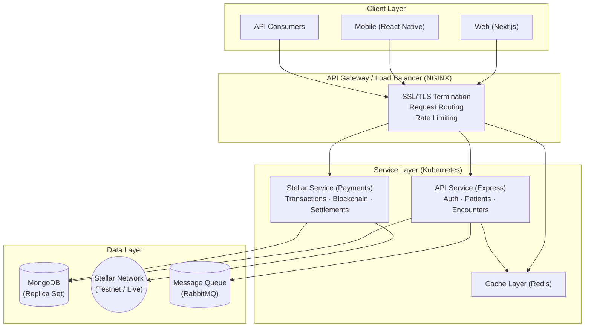
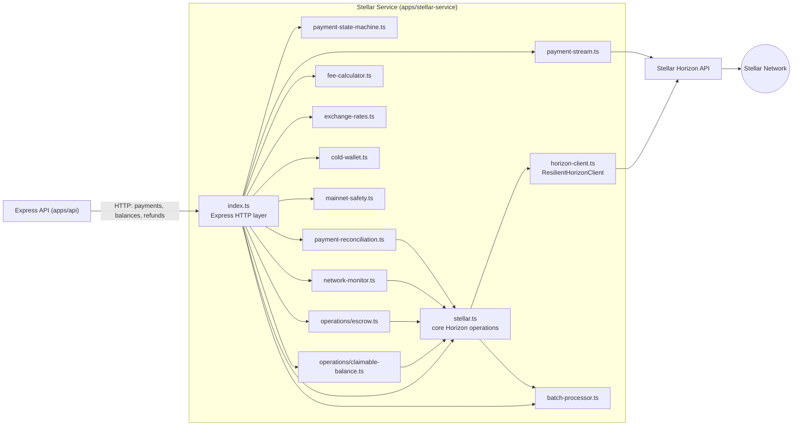
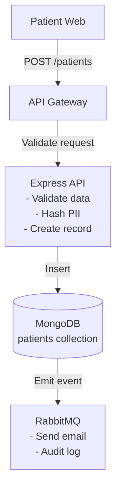
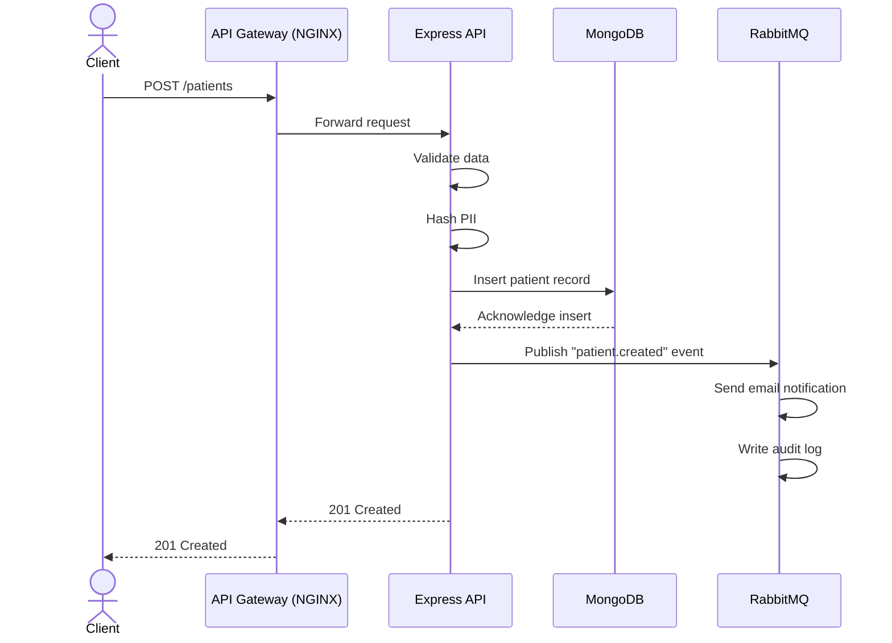
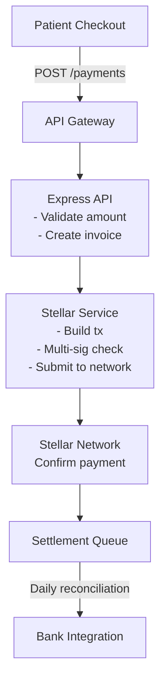
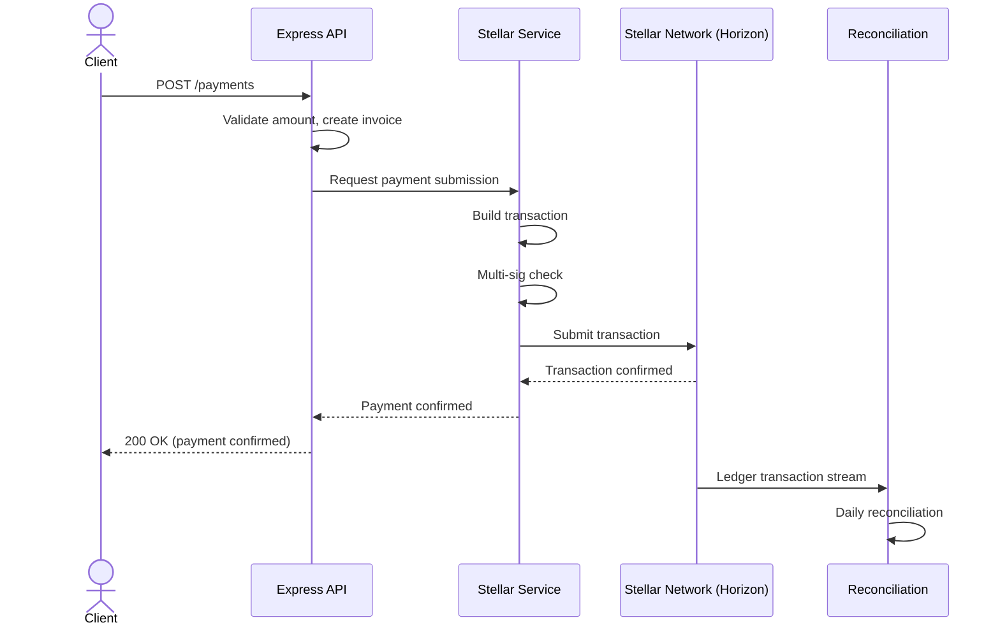
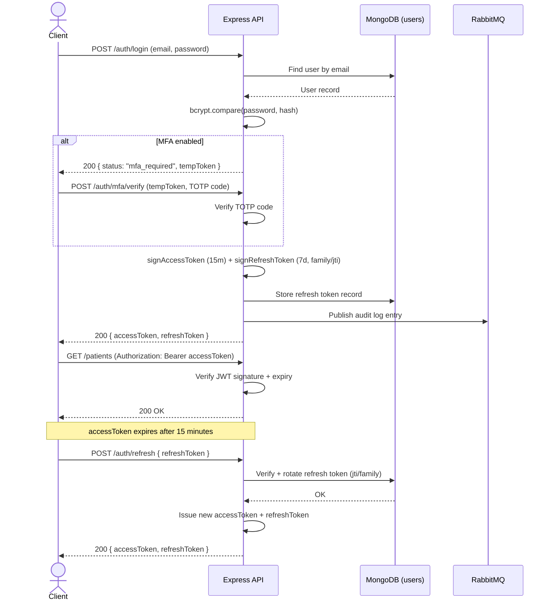
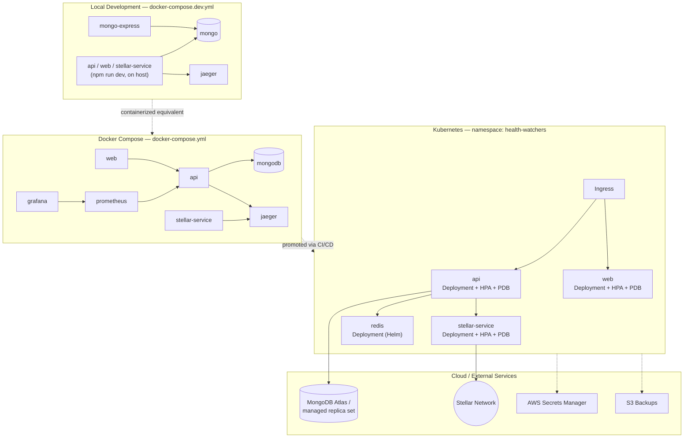

# System Architecture

## Overview

Health Watchers is a HIPAA-compliant healthcare management platform built with a microservices architecture. This document provides comprehensive system design, component relationships, and deployment topology.

## High-Level Architecture Diagram



Source: [`docs/diagrams/system-architecture.mmd`](diagrams/system-architecture.mmd)

## Component Architecture

### 1. Frontend Layer

**Web Application (Next.js)**
- Framework: Next.js 14 with React 18
- Rendering: Server-side rendering (SSR) and static generation
- State Management: React Query for server state
- Styling: Tailwind CSS
- Internationalization: i18n for EN/FR support
- Authentication: JWT tokens with refresh mechanism

**Mobile Application (React Native)**
- Cross-platform support (iOS/Android)
- Offline-first capabilities with local storage
- Deep linking support
- Push notifications integration

### 2. API Gateway / Load Balancer

**NGINX Configuration**
```
- SSL/TLS termination
- Request routing to services
- Rate limiting (10,000 req/min)
- Gzip compression
- Cache headers management
```

### 3. Application Services

#### API Service (Express.js)
```
Port: 3001
Handlers:
├── Authentication & Authorization
│   ├── JWT validation
│   ├── Role-based access control (RBAC)
│   └── Multi-factor authentication
├── Patient Management
│   ├── CRUD operations
│   ├── Health records
│   └── Document storage
├── Medical Encounters
│   ├── Appointment scheduling
│   ├── Consultation notes
│   └── Outcome tracking
└── Audit Logging
    ├── All mutations
    └── Access tracking
```

#### Stellar Service (Payment Processing)
```
Port: 3002
Handlers:
├── Account Management
│   ├── Keypair generation
│   ├── Balance queries
│   └── Account creation
├── Transaction Processing
│   ├── Payment submission
│   ├── Multi-signature validation
│   └── Transaction tracking
└── Settlement Management
    ├── Daily reconciliation
    └── Dispute handling
```

**Internal Component Map**

The diagram below shows how the modules inside `apps/stellar-service` (transaction building,
payment streaming, reconciliation, cold wallet, mainnet safety checks, etc.) connect to the main
API and to the Stellar Horizon API/network, grounded in the actual imports in
`apps/stellar-service/src`.



Source: [`docs/diagrams/stellar-integration-components.mmd`](diagrams/stellar-integration-components.mmd)

#### Redis Cache Layer
```
Port: 6379
Usage:
├── Session storage
├── Rate limiting counters
├── Real-time data caching
└── Queue management
```

### 4. Data Layer

**MongoDB**
- Replica Set for high availability
- Primary: Active read/write
- Secondary: Read replicas for distribution
- Collections:
  - `patients`: Patient demographics and health records
  - `encounters`: Medical encounter documentation
  - `transactions`: Payment/blockchain transactions
  - `audit_logs`: Comprehensive audit trail
  - `users`: User accounts and credentials

**Stellar Blockchain**
- Testnet for development/staging
- Mainnet for production
- Custom token: Healthcare tokens (HWT)

**RabbitMQ Message Queue**
- Asynchronous job processing
- Email notifications
- Audit log batching
- Report generation

### 5. Security Architecture

**Authentication Flow**
```
User → Login → JWT Generation → Token Storage → Authenticated Requests
                     ↓
            Refresh Token (7 days)
```

**Encryption**
- TLS 1.3 for transport
- AES-256-GCM for data at rest
- Sensitive fields hashed (PII)

**Access Control**
```
User Role → Permission Set → Resource Access
├── Admin: Full system access
├── Doctor: Patient management + encounter creation
├── Nurse: Encounter support + data entry
└── Patient: Own record view
```

## Data Flow Diagrams

### Patient Registration Flow



Source: [`docs/diagrams/data-flow-patient-management.mmd`](diagrams/data-flow-patient-management.mmd)

For the detailed message-level sequence (gateway forwarding, DB acknowledgement, event
publication), see the companion sequence diagram:



Source: [`docs/diagrams/sequence-patient-registration.mmd`](diagrams/sequence-patient-registration.mmd)

### Payment Processing Flow



Source: [`docs/diagrams/data-flow-payments-blockchain.mmd`](diagrams/data-flow-payments-blockchain.mmd)

For the detailed message-level sequence (transaction build, multi-sig check, Horizon submission,
reconciliation stream), see the companion sequence diagram:



Source: [`docs/diagrams/sequence-payment-processing.mmd`](diagrams/sequence-payment-processing.mmd)

### Authentication Flow



Source: [`docs/diagrams/auth-flow.mmd`](diagrams/auth-flow.mmd)

## Deployment Architecture

### Kubernetes Topology

```yaml
Namespace: health-watchers
├── API Deployment
│   ├── Replicas: 3
│   ├── CPU: 500m
│   └── Memory: 512Mi
├── Stellar Service Deployment
│   ├── Replicas: 2
│   ├── CPU: 250m
│   └── Memory: 256Mi
├── Web Deployment
│   ├── Replicas: 2
│   ├── CPU: 200m
│   └── Memory: 256Mi
├── Redis StatefulSet
│   ├── Replicas: 1
│   └── Memory: 1Gi
├── MongoDB StatefulSet
│   ├── Replicas: 3 (replica set)
│   └── Memory: 2Gi each
└── RabbitMQ StatefulSet
    ├── Replicas: 1
    └── Memory: 512Mi
```

The diagram below shows the same topology end-to-end across environments — local
`docker-compose.dev.yml`, containerized `docker-compose.yml`, the Kubernetes `health-watchers`
namespace, and the managed cloud services each promotes to:



Source: [`docs/diagrams/deployment-architecture.mmd`](diagrams/deployment-architecture.mmd)

### Blue-Green Deployment Strategy

```
Traffic
  │
  ├─→ Blue Environment (Active)
  │   ├── API v2.0
  │   ├── Database: Current schema
  │   └── Connection: 100%
  │
  └─→ Green Environment (Standby)
      ├── API v2.1 (new)
      ├── Database: Migrated schema
      └── Connection: 0%
      
After validation:
Traffic switches to Green
Blue becomes Standby
```

Both slots run full replica counts at all times so traffic only switches once
the new slot reports healthy, giving zero-downtime cutover and an instant
rollback path. See [docs/BLUE_GREEN_DEPLOYMENT.md](BLUE_GREEN_DEPLOYMENT.md)
for the full runbook and `k8s/api/blue-green/` for the manifests.

## Integration Points

### External Services
- **Google Gemini API**: AI-powered insights
- **AWS Secrets Manager**: Credential management
- **SendGrid**: Email delivery
- **Sentry**: Error tracking
- **SonarCloud**: Code quality

### Third-party Integrations
- Stellar DEX for token exchange
- Payment gateways for settlements
- EHR systems via HL7 FHIR

## Disaster Recovery

**RPO (Recovery Point Objective)**: 5 minutes
**RTO (Recovery Time Objective)**: 15 minutes

```
Backup Strategy:
├── Daily incremental backups → S3
├── Weekly full backups → S3 Glacier
└── Point-in-time recovery: 30 days

Replication:
├── MongoDB replica set: 3 nodes
├── Cross-region backup: AWS Backup Vault
└── Failover: Automatic election
```

## Monitoring & Observability

**Prometheus Metrics**
```
- API response time (p50, p95, p99)
- Error rates by endpoint
- Transaction success rate
- Certificate expiry countdown
- Database replication lag
```

**Alerts**
```
- API error rate > 1%
- Response time > 2s
- Certificate expires in < 7 days
- MongoDB connection pool exhaustion
- Stellar network unavailable
```

**Logging**
```
- Structured JSON logs (Winston)
- Elasticsearch aggregation
- Kibana dashboards
- Log retention: 30 days
```

## Security Considerations

1. **Network Security**
   - Network policies (Kubernetes)
   - Ingress/egress controls
   - API rate limiting

2. **Data Security**
   - Encryption at rest (AES-256)
   - Encryption in transit (TLS 1.3)
   - Field-level PII encryption

3. **Access Control**
   - RBAC with least privilege
   - Audit logging of all mutations
   - MFA for sensitive operations

4. **Compliance**
   - HIPAA audit trails
   - Data retention policies
   - Consent management

## Performance Characteristics

| Metric | Target | Current |
|--------|--------|---------|
| API P99 Latency | < 500ms | 340ms |
| Throughput | 10K req/sec | 8.5K req/sec |
| Database Query P95 | < 100ms | 75ms |
| Cache Hit Rate | > 80% | 85% |

## Future Architecture Improvements

1. **Event Sourcing**: Complete audit trail
2. **CQRS**: Separate read/write models
3. **Service Mesh**: Istio for advanced routing
4. **Multi-region**: Active-active deployments
5. **Graphql**: Flexible query API
