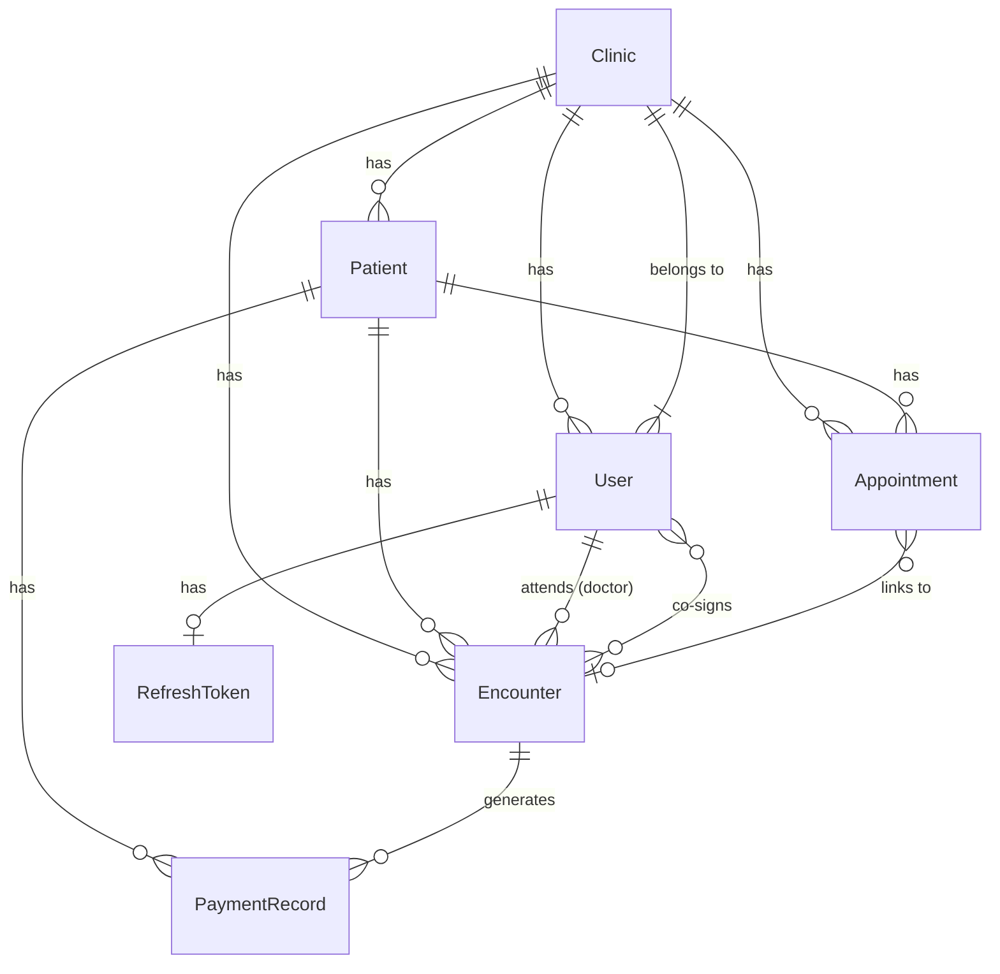

# Database Schema Documentation

Health Watchers uses MongoDB with Mongoose. All schema changes are version-controlled via [migrate-mongo](https://github.com/seppevs/migrate-mongo). Migrations live in `apps/api/src/migrations/`.

---

## Core Collections ERD



---

## Core Collections

### `patients`

Stores all patient records. PHI fields are encrypted at rest using AES-256.

| Field | Type | Notes |
|-------|------|-------|
| `_id` | ObjectId | MongoDB auto-generated |
| `systemId` | String | Unique patient identifier |
| `firstName` | String | |
| `lastName` | String | |
| `searchName` | String | Normalized for search |
| `dateOfBirth` | String | **PHI — encrypted** |
| `sex` | `'M'\|'F'\|'O'` | |
| `contactNumber` | String | **PHI — encrypted** |
| `address` | String | **PHI — encrypted + sanitized** |
| `clinicId` | ObjectId → Clinic | |
| `isActive` | Boolean | Soft delete flag |
| `allergies` | Array | See sub-schema below |
| `emergencyContacts` | Array | See sub-schema below |
| `insurance` | Array | See sub-schema below |
| `riskScore` | Number (0–100) | AI-calculated |
| `riskLevel` | `'low'\|'medium'\|'high'\|'critical'` | |
| `riskFactors` | String[] | |
| `photoUrl` / `thumbnailUrl` | String | |
| `isDuplicate` | Boolean | Set during merge detection |
| `mergedInto` | ObjectId → Patient | |
| `createdAt` / `updatedAt` | Date | Auto-managed |

**allergies sub-schema**

| Field | Type | Notes |
|-------|------|-------|
| `allergen` | String | |
| `allergenType` | `'drug'\|'food'\|'environmental'\|'other'` | |
| `reaction` | String | |
| `severity` | `'mild'\|'moderate'\|'severe'\|'life-threatening'` | |
| `onsetDate` | Date | Optional |
| `recordedBy` | ObjectId → User | |
| `isActive` | Boolean | |

**insurance sub-schema** (PHI encrypted)

| Field | Type | Notes |
|-------|------|-------|
| `provider` | String | |
| `policyNumber` | String | **PHI — encrypted** |
| `groupNumber` | String | **PHI — encrypted** |
| `coverageType` | `'HMO'\|'PPO'\|'EPO'\|'POS'\|'HDHP'\|'Medicare'\|'Medicaid'\|'other'` | |
| `effectiveDate` / `expirationDate` | String | |
| `isPrimary` | Boolean | |

**Indexes**

| Index | Fields | Notes |
|-------|--------|-------|
| `systemId_unique` | `systemId` | Unique |
| `searchName_1` | `searchName` | |
| `clinicId_1` | `clinicId` | |
| `isActive_1` | `isActive` | |
| `clinicId_1_createdAt_-1` | `clinicId, createdAt DESC` | Dashboard aggregation |

---

### `users`

Staff and patient portal accounts. Sensitive fields use `select: false`.

| Field | Type | Notes |
|-------|------|-------|
| `_id` | ObjectId | |
| `fullName` | String | |
| `email` | String | Unique, lowercase |
| `password` | String | bcrypt (12 rounds), never returned |
| `role` | Enum | `SUPER_ADMIN`, `CLINIC_ADMIN`, `DOCTOR`, `NURSE`, `ASSISTANT`, `READ_ONLY`, `PATIENT` |
| `clinicId` | ObjectId → Clinic | |
| `patientId` | ObjectId → Patient | Set only when `role === 'PATIENT'` |
| `isActive` / `emailVerified` / `mfaEnabled` | Boolean | |
| `mfaSecret` / `mfaBackupCodes` | String / String[] | `select: false` |
| `resetPasswordTokenHash` | String | `select: false` |
| `resetPasswordExpiresAt` | Date | `select: false` |
| `failedLoginAttempts` / `failedMfaAttempts` | Number | Brute-force counter |
| `lockedUntil` | Date | Account lockout timestamp |
| `mustChangePassword` | Boolean | Force password change on next login |
| `mfaGracePeriodEndsAt` | Date | DOCTOR/NURSE MFA enforcement deadline |
| `preferences` | Object | Language, theme, notification toggles |
| `stellarPublicKey` | String | Doctor's Stellar wallet (sparse index) |
| `portalMfa*` | Various | Patient portal MFA fields |

**Indexes**

| Index | Fields |
|-------|--------|
| `email_unique` | `email` (unique) |
| `isActive_1` | `isActive` |
| `resetPasswordExpiresAt_1` | `resetPasswordExpiresAt` |
| `lockedUntil_1` | `lockedUntil` |
| Compound | `{clinicId, role}` |
| Compound | `{clinicId, isActive}` |

---

### `clinics`

Clinic organisations. Each user and patient belongs to exactly one clinic.

| Field | Type | Notes |
|-------|------|-------|
| `_id` | ObjectId | |
| `name` / `address` / `phone` / `email` | String | |
| `stellarPublicKey` | String | Clinic Stellar wallet (sparse) |
| `federationAddress` | String | Stellar federation address (unique sparse) |
| `subscriptionTier` | `'free'\|'basic'\|'premium'` | |
| `isActive` / `onboardingCompleted` | Boolean | |
| `onboardingStep` | Number (1–5) | Onboarding progress |
| `createdBy` | ObjectId → User | |
| `paymentSplitConfig` | Object | `{ splitEnabled, defaultSplitRatio{clinic%, doctor%}, doctorOverrides[] }` |

---

### `encounters`

Medical encounters (consultations, telemedicine, procedures). Free-text fields are HTML-sanitized before save.

| Field | Type | Notes |
|-------|------|-------|
| `_id` | ObjectId | |
| `patientId` | ObjectId → Patient | |
| `clinicId` | ObjectId → Clinic | |
| `attendingDoctorId` | ObjectId → User | |
| `encounteredBy` | ObjectId → User | Nurse/assistant who recorded |
| `type` | `'consultation'\|'telemedicine'\|'follow-up'\|'procedure'` | |
| `appointmentId` | ObjectId → Appointment | Optional |
| `chiefComplaint` | String | Sanitized |
| `status` | `'open'\|'closed'\|'follow-up'\|'cancelled'\|'pending_cosignature'` | |
| `soapNotes` | Object | `{ subjective, objective, assessment, plan }` — HTML sanitized |
| `diagnosis` | Array | `[{ code (ICD-10), description, isPrimary }]` |
| `vitalSigns` | Object | BP, HR, temp, RR, O2sat, weight, height |
| `prescriptions` | Array | Drug, dosage, frequency, route, prescriber |
| `billing` | Object | CPT codes, billing status, total fee |
| `attachments` | Array | File metadata (PDF/JPEG/PNG/DICOM) |
| `requiresCoSignature` | Boolean | |
| `coSignatureStatus` | `'pending'\|'approved'\|'rejected'` | |
| `coSignedBy` | ObjectId → User | |

**Indexes**

| Index | Fields | Purpose |
|-------|--------|---------|
| Compound | `{clinicId, patientId, createdAt DESC}` | Paginated queries |
| Compound | `{clinicId, createdAt DESC}` | Clinic encounter list |
| Compound | `{patientId, createdAt DESC}` | Patient history |
| Compound | `{clinicId, patientId, status}` | Status filter |
| Compound | `{clinicId, status, createdAt DESC}` | Status-first filter |
| Compound | `{clinicId, attendingDoctorId, createdAt DESC}` | Doctor-scoped queries |
| Text | `chiefComplaint, notes` | Full-text search |

---

### `paymentrecords`

Stellar blockchain payment records.

| Field | Type | Notes |
|-------|------|-------|
| `intentId` | String | Unique payment intent |
| `status` | String | Payment state |
| `clinicId` | ObjectId → Clinic | |
| `patientId` | ObjectId → Patient | |

**Indexes**: `intentId` (unique), `status`, `clinicId`, `patientId`, `{status, createdAt}`.

---

## Supporting Collections

| Collection | Purpose |
|------------|---------|
| `appointments` | Scheduled patient appointments |
| `notifications` | In-app notification records |
| `surveys` | Patient satisfaction surveys |
| `invoices` / `invoicecounters` | Billing invoices |
| `referrals` | Patient referrals between clinics |
| `labresults` | Lab test results |
| `immunizations` | Immunization records |
| `careplans` | Long-term care plans |
| `medicationhistories` | Medication history |
| `documents` | Uploaded documents |
| `consentforms` | HIPAA consent forms |
| `subscriptions` / `usages` | Clinic subscription tracking |
| `webhooks` | Outbound webhook configurations |
| `refreshtokens` | JWT refresh token store |
| `breachincidents` | HIPAA breach incident reports |
| `apikeys` | API key credentials |
| `auditlogs` | HIPAA audit trail (TTL-indexed) |
| `changelog` | migrate-mongo migration tracking |

---

## Collection Relationships

```
Clinic  ──┬──< User          (clinicId)
          ├──< Patient       (clinicId)
          ├──< Encounter     (clinicId)
          └──< Appointment   (clinicId)

Patient ──┬──< Encounter     (patientId)
          ├──< Appointment   (patientId)
          └──< PaymentRecord (patientId)

User    ──┬──< Encounter     (attendingDoctorId / encounteredBy)
          └──< RefreshToken  (userId)

Encounter ─── Appointment    (appointmentId, optional)
Encounter ─── PaymentRecord  (via billing flow)
User (PATIENT role) ──── Patient  (patientId)
```

---

## Index Strategy

- All `clinicId` fields are indexed to scope queries to a single clinic.
- Compound indexes follow ESR (Equality, Sort, Range) ordering.
- Text indexes on free-text fields (`chiefComplaint`, `notes`, patient name) enable full-text search.
- TTL index on `auditlogs` enforces automatic data retention.
- Sparse indexes on `stellarPublicKey` and `federationAddress` (only index non-null values).
- All migrations use named indexes to ensure idempotency on re-run.

---

## Migration Guide

### Commands

Run from the repo root:

```bash
# Apply all pending migrations
npm run migrate:up --workspace=api

# Roll back the last applied migration
npm run migrate:down --workspace=api

# Show migration status
npm run migrate:status --workspace=api

# Scaffold a new migration
npm run migrate:create --workspace=api -- YYYYMMDD_description
```

### Naming Convention

Prefix files with `YYYYMMDD_` for lexicographic ordering:

```
apps/api/src/migrations/20260627_add_new_index.ts
```

### Migration Template

```typescript
import { Db } from 'mongodb';

export async function up(db: Db): Promise<void> {
  await db.collection('patients').createIndex(
    { clinicId: 1, someField: 1 },
    { background: true, name: 'clinicId_1_someField_1' }
  );
}

export async function down(db: Db): Promise<void> {
  await db.collection('patients')
    .dropIndex('clinicId_1_someField_1')
    .catch(() => {});
}
```

Rules:
- Every migration **must** export both `up` and `down`.
- `down` must exactly reverse `up`.
- Use idempotent operations (e.g. `createIndex` with a named index, `$exists` guards on `updateMany`).
- Migrations are tracked in the `changelog` collection.

### CI Behaviour

`migrate:up` runs automatically in the CI `test` job before the test suite (see `.github/workflows/ci.yml`). Run it as part of your deployment pipeline before starting the API server.

### Rollback Strategy

```bash
# 1. Revert the last applied migration
npm run migrate:down --workspace=api

# 2. Fix the migration file
# 3. Re-apply
npm run migrate:up --workspace=api
```
