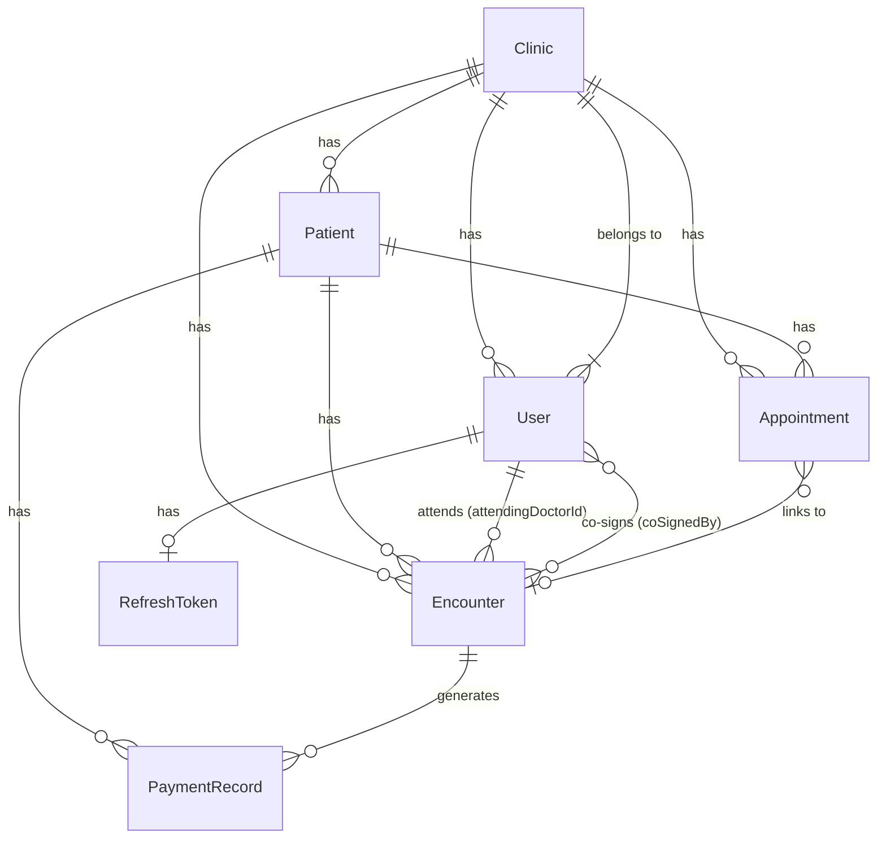

# Database Schema Documentation

Health Watchers uses MongoDB with Mongoose. All schema changes are version-controlled via [migrate-mongo](https://github.com/seppevs/migrate-mongo). Migrations live in `apps/api/src/migrations/`.

---

## Table of Contents

- [Schema Diagrams](#schema-diagrams)
- [Core Collections](#core-collections)
  - [patients](#patients)
  - [users](#users)
  - [clinics](#clinics)
  - [encounters](#encounters)
  - [appointments](#appointments)
  - [paymentrecords](#paymentrecords)
  - [refreshtokens](#refreshtokens)
  - [auditlogs](#auditlogs)
  - [apikeys](#apikeys)
- [Supporting Collections](#supporting-collections)
- [Collection Relationships](#collection-relationships)
- [Index Strategy](#index-strategy)
- [Connection Pooling & Resilience](#connection-pooling--resilience)
- [Migration Guide](#migration-guide)

---

## Schema Diagrams

### Entity Relationship Diagram — Core Collections


```mermaid
erDiagram
    Clinic ||--o{ User : "has"
    Clinic ||--o{ Patient : "has"
    Clinic ||--o{ Encounter : "has"
    Clinic ||--o{ Appointment : "has"
    Patient ||--o{ Encounter : "has"
    Patient ||--o{ Appointment : "has"
    Patient ||--o{ PaymentRecord : "has"
    User ||--o{ Encounter : "attends (attendingDoctorId)"
    User }o--o{ Encounter : "co-signs (coSignedBy)"
    Encounter ||--o{ PaymentRecord : "generates"
    Appointment }o--o| Encounter : "links to"
    User ||--o| RefreshToken : "has"
    User }|--|| Clinic : "belongs to"
```

### High-Level Ownership Hierarchy

```
Clinic
 ├── Users          (staff: doctors, nurses, admins)
 ├── Patients       (patient records)
 ├── Encounters     (medical consultations)
 ├── Appointments   (scheduled visits)
 └── Invoices       (billing records)

Patient
 ├── Encounters     (medical history)
 ├── Appointments   (visit schedule)
 ├── PaymentRecords (Stellar blockchain payments)
 ├── LabResults     (lab tests)
 ├── Immunizations  (vaccination records)
 ├── CarePlans      (long-term treatment plans)
 └── ConsentForms   (HIPAA consent)

User (PATIENT role)
 └── Patient        (one-to-one: portal account → patient record)
```

---

## Core Collections

### `patients`

Stores all patient records. PHI (Protected Health Information) fields are encrypted at rest using AES-256.

| Field | Type | Notes |
|-------|------|-------|
| `_id` | ObjectId | MongoDB auto-generated primary key |
| `systemId` | String | Unique patient identifier (e.g. `PAT-000001`) |
| `firstName` | String | |
| `lastName` | String | |
| `searchName` | String | Normalized lowercase for case-insensitive search |
| `dateOfBirth` | String | **PHI — encrypted at rest** |
| `sex` | `'M' \| 'F' \| 'O'` | |
| `contactNumber` | String | **PHI — encrypted at rest** |
| `address` | String | **PHI — encrypted at rest + HTML sanitized** |
| `clinicId` | ObjectId → `clinics` | Owning clinic |
| `isActive` | Boolean | Soft delete flag |
| `allergies` | Array | See sub-schema |
| `emergencyContacts` | Array | See sub-schema |
| `insurance` | Array | See sub-schema — **PHI encrypted** |
| `riskScore` | Number (0–100) | AI-calculated risk score |
| `riskLevel` | `'low' \| 'medium' \| 'high' \| 'critical'` | Derived from `riskScore` |
| `riskFactors` | String[] | Reasons contributing to risk level |
| `photoUrl` | String | Full-size profile photo URL |
| `thumbnailUrl` | String | Thumbnail photo URL |
| `isDuplicate` | Boolean | Set to `true` during duplicate merge detection |
| `mergedInto` | ObjectId → `patients` | Set when this record is merged into another |
| `createdAt` | Date | Auto-managed by Mongoose timestamps |
| `updatedAt` | Date | Auto-managed by Mongoose timestamps |

**allergies sub-schema**

| Field | Type | Notes |
|-------|------|-------|
| `allergen` | String | Name of the allergen |
| `allergenType` | `'drug' \| 'food' \| 'environmental' \| 'other'` | |
| `reaction` | String | Description of the allergic reaction |
| `severity` | `'mild' \| 'moderate' \| 'severe' \| 'life-threatening'` | |
| `onsetDate` | Date | Optional date when allergy was first noted |
| `recordedBy` | ObjectId → `users` | Staff member who recorded the allergy |
| `isActive` | Boolean | Whether the allergy is currently active |

**emergencyContacts sub-schema**

| Field | Type |
|-------|------|
| `name` | String |
| `relationship` | String |
| `phone` | String |

**insurance sub-schema** (PHI — encrypted at rest)

| Field | Type | Notes |
|-------|------|-------|
| `provider` | String | Insurance company name |
| `policyNumber` | String | **PHI — encrypted** |
| `groupNumber` | String | **PHI — encrypted** |
| `coverageType` | `'HMO' \| 'PPO' \| 'EPO' \| 'POS' \| 'HDHP' \| 'Medicare' \| 'Medicaid' \| 'other'` | |
| `effectiveDate` | String | Coverage start date |
| `expirationDate` | String | Coverage end date |
| `isPrimary` | Boolean | Whether this is the primary insurance |

**Indexes**

| Index Name | Fields | Type | Notes |
|------------|--------|------|-------|
| `systemId_unique` | `systemId` | Unique | |
| `searchName_1` | `searchName` | Single-field | |
| `clinicId_1` | `clinicId` | Single-field | |
| `isActive_1` | `isActive` | Single-field | |
| `clinicId_1_createdAt_-1` | `{ clinicId: 1, createdAt: -1 }` | Compound | Dashboard aggregation |

---

### `users`

Staff accounts and patient portal accounts. Sensitive credential fields use `select: false` and are never returned in API responses.

| Field | Type | Notes |
|-------|------|-------|
| `_id` | ObjectId | |
| `fullName` | String | |
| `email` | String | Unique, stored lowercase |
| `password` | String | bcrypt (12 rounds). `select: false` — never returned |
| `role` | Enum | See roles table below |
| `clinicId` | ObjectId → `clinics` | Owning clinic |
| `patientId` | ObjectId → `patients` | Set only when `role === 'PATIENT'` |
| `isActive` | Boolean | Account active flag |
| `emailVerified` | Boolean | Whether email address is verified |
| `mfaEnabled` | Boolean | Whether TOTP MFA is enabled |
| `mfaSecret` | String | TOTP secret. `select: false` |
| `mfaBackupCodes` | String[] | Hashed one-time backup codes. `select: false` |
| `resetPasswordTokenHash` | String | Hashed password reset token. `select: false` |
| `resetPasswordExpiresAt` | Date | Expiry of the reset token. `select: false` |
| `failedLoginAttempts` | Number | Brute-force attempt counter |
| `failedMfaAttempts` | Number | MFA attempt counter |
| `lockedUntil` | Date | Account lockout expiry timestamp |
| `mustChangePassword` | Boolean | Force password change on next login |
| `mfaGracePeriodEndsAt` | Date | DOCTOR/NURSE MFA enforcement deadline |
| `preferences` | Object | `{ language, theme, notifications }` |
| `stellarPublicKey` | String | Doctor's Stellar wallet public key (sparse index) |
| `portalMfaEnabled` | Boolean | Patient portal MFA flag |
| `portalMfaSecret` | String | Patient portal TOTP secret. `select: false` |
| `createdAt` / `updatedAt` | Date | Auto-managed |

**User roles**

| Role | Description |
|------|-------------|
| `SUPER_ADMIN` | Platform-level administrator |
| `CLINIC_ADMIN` | Clinic administrator |
| `DOCTOR` | Attending physician; required to enable MFA |
| `NURSE` | Nursing staff; required to enable MFA |
| `ASSISTANT` | Clinical assistant |
| `READ_ONLY` | View-only access |
| `PATIENT` | Patient portal account; linked to a `patients` record |

**Indexes**

| Index | Fields | Notes |
|-------|--------|-------|
| `email_unique` | `email` | Unique |
| `isActive_1` | `isActive` | |
| `resetPasswordExpiresAt_1` | `resetPasswordExpiresAt` | Used for token expiry queries |
| `lockedUntil_1` | `lockedUntil` | Used for lockout cleanup |
| Compound | `{ clinicId: 1, role: 1 }` | |
| Compound | `{ clinicId: 1, isActive: 1 }` | |
| `stellarPublicKey` (sparse) | `stellarPublicKey` | Only indexes non-null values |

---

### `clinics`

Clinic organisations. Every user and patient belongs to exactly one clinic.

| Field | Type | Notes |
|-------|------|-------|
| `_id` | ObjectId | |
| `name` | String | Clinic display name |
| `address` | String | |
| `phone` | String | |
| `email` | String | |
| `stellarPublicKey` | String | Clinic Stellar wallet (sparse index) |
| `federationAddress` | String | Stellar federation address — unique sparse index |
| `subscriptionTier` | `'free' \| 'basic' \| 'premium'` | Determines feature access |
| `isActive` | Boolean | |
| `onboardingCompleted` | Boolean | |
| `onboardingStep` | Number (1–5) | Tracks onboarding progress |
| `createdBy` | ObjectId → `users` | Admin who created the clinic |
| `paymentSplitConfig` | Object | See split config below |
| `createdAt` / `updatedAt` | Date | |

**paymentSplitConfig sub-schema**

| Field | Type | Notes |
|-------|------|-------|
| `splitEnabled` | Boolean | Whether payment splitting is enabled |
| `defaultSplitRatio.clinicPercent` | Number | Default clinic share (e.g. 70) |
| `defaultSplitRatio.doctorPercent` | Number | Default doctor share (e.g. 30) |
| `doctorOverrides` | Array | Per-doctor custom split ratios |

---

### `encounters`

Medical encounters — consultations, telemedicine, follow-ups, and procedures. Free-text clinical fields (SOAP notes, chief complaint) are HTML-sanitized before saving to prevent XSS.

| Field | Type | Notes |
|-------|------|-------|
| `_id` | ObjectId | |
| `patientId` | ObjectId → `patients` | |
| `clinicId` | ObjectId → `clinics` | |
| `attendingDoctorId` | ObjectId → `users` | The attending physician |
| `encounteredBy` | ObjectId → `users` | Nurse/assistant who recorded the encounter |
| `type` | `'consultation' \| 'telemedicine' \| 'follow-up' \| 'procedure'` | |
| `appointmentId` | ObjectId → `appointments` | Optional — links to a scheduled appointment |
| `chiefComplaint` | String | HTML-sanitized |
| `status` | `'open' \| 'closed' \| 'follow-up' \| 'cancelled' \| 'pending_cosignature'` | |
| `soapNotes` | Object | `{ subjective, objective, assessment, plan }` — all HTML-sanitized |
| `diagnosis` | Array | `[{ code (ICD-10), description, isPrimary }]` |
| `vitalSigns` | Object | `{ bloodPressure, heartRate, temperature, respiratoryRate, oxygenSaturation, weight, height }` |
| `prescriptions` | Array | `[{ drug, dosage, frequency, route, prescriberId }]` |
| `billing` | Object | `{ cptCodes, billingStatus, totalFee }` |
| `attachments` | Array | File metadata `[{ fileName, mimeType, url, uploadedBy }]` — PDF/JPEG/PNG/DICOM |
| `requiresCoSignature` | Boolean | Whether a co-signature is required |
| `coSignatureStatus` | `'pending' \| 'approved' \| 'rejected'` | |
| `coSignedBy` | ObjectId → `users` | Doctor who co-signed |
| `createdAt` / `updatedAt` | Date | |

**Indexes**

| Index | Fields | Purpose |
|-------|--------|---------|
| Compound | `{ clinicId: 1, patientId: 1, createdAt: -1 }` | Paginated patient encounter history |
| Compound | `{ clinicId: 1, createdAt: -1 }` | Clinic-wide encounter list |
| Compound | `{ patientId: 1, createdAt: -1 }` | Patient-scoped history |
| Compound | `{ clinicId: 1, patientId: 1, status: 1 }` | Status-filtered queries |
| Compound | `{ clinicId: 1, status: 1, createdAt: -1 }` | Status-first filtered queries |
| Compound | `{ clinicId: 1, attendingDoctorId: 1, createdAt: -1 }` | Doctor-scoped queries |
| Text | `chiefComplaint, notes` | Full-text search |

---

### `appointments`

Scheduled patient appointments.

| Field | Type | Notes |
|-------|------|-------|
| `_id` | ObjectId | |
| `patientId` | ObjectId → `patients` | |
| `clinicId` | ObjectId → `clinics` | |
| `doctorId` | ObjectId → `users` | |
| `scheduledAt` | Date | Appointment date and time |
| `duration` | Number | Duration in minutes |
| `type` | String | `'consultation' \| 'follow-up' \| 'procedure'` |
| `status` | String | `'scheduled' \| 'confirmed' \| 'cancelled' \| 'completed' \| 'no-show'` |
| `notes` | String | HTML-sanitized |
| `reminders` | Array | Reminder schedule metadata |
| `encounterId` | ObjectId → `encounters` | Set when encounter is created from this appointment |
| `createdAt` / `updatedAt` | Date | |

**Indexes**: `{ clinicId, doctorId, scheduledAt }`, `{ clinicId, patientId, scheduledAt }`, `{ clinicId, status }`.

---

### `paymentrecords`

Stellar blockchain payment records. Each record tracks the lifecycle of a single payment from intent creation through Stellar network confirmation.

| Field | Type | Notes |
|-------|------|-------|
| `_id` | ObjectId | |
| `intentId` | String | Unique payment intent ID (UUID) |
| `status` | String | `'pending' \| 'processing' \| 'completed' \| 'failed' \| 'expired' \| 'refunded'` |
| `clinicId` | ObjectId → `clinics` | |
| `patientId` | ObjectId → `patients` | |
| `encounterId` | ObjectId → `encounters` | Optional |
| `amount` | Number | Amount in XLM |
| `currency` | String | Payment currency code |
| `stellarTxHash` | String | Stellar network transaction hash |
| `stellarLedger` | Number | Ledger number of confirmation |
| `splitDetails` | Object | `{ clinicAmount, doctorAmount }` if split enabled |
| `createdAt` / `updatedAt` | Date | |

**Indexes**: `intentId` (unique), `{ status: 1 }`, `{ clinicId: 1 }`, `{ patientId: 1 }`, `{ status: 1, createdAt: -1 }`.

---

### `refreshtokens`

JWT refresh token store. One active refresh token per user.

| Field | Type | Notes |
|-------|------|-------|
| `_id` | ObjectId | |
| `userId` | ObjectId → `users` | |
| `tokenHash` | String | SHA-256 hash of the refresh token |
| `expiresAt` | Date | TTL index removes expired tokens automatically |
| `createdAt` | Date | |

**Indexes**: `userId` (unique — one token per user), `expiresAt` (TTL index).

---

### `auditlogs`

HIPAA-required audit trail for all PHI access and mutations. Automatically expires after the configured retention period via a TTL index.

| Field | Type | Notes |
|-------|------|-------|
| `_id` | ObjectId | |
| `userId` | ObjectId → `users` | Actor performing the action |
| `clinicId` | ObjectId → `clinics` | |
| `action` | String | Action type (e.g. `READ_PATIENT`, `UPDATE_ENCOUNTER`) |
| `resourceType` | String | Collection/resource name |
| `resourceId` | ObjectId | ID of the affected document |
| `ipAddress` | String | Client IP address |
| `userAgent` | String | Client user agent |
| `requestId` | String | Correlation ID for tracing |
| `changes` | Object | Before/after diff for mutations |
| `createdAt` | Date | TTL index field |

**Indexes**: `{ userId, createdAt }`, `{ clinicId, createdAt }`, `{ resourceType, resourceId }`, `createdAt` (TTL — enforces data retention).

---

### `apikeys`

API key credentials for programmatic access.

| Field | Type | Notes |
|-------|------|-------|
| `_id` | ObjectId | |
| `keyHash` | String | SHA-256 hash of the API key — never stored in plaintext |
| `clinicId` | ObjectId → `clinics` | |
| `createdBy` | ObjectId → `users` | |
| `name` | String | Human-readable label |
| `permissions` | String[] | Array of allowed scopes |
| `lastUsedAt` | Date | |
| `expiresAt` | Date | Optional expiry |
| `isActive` | Boolean | |
| `createdAt` / `updatedAt` | Date | |

---

## Supporting Collections

| Collection | Purpose |
|------------|---------|
| `notifications` | In-app notification records for users |
| `surveys` | Patient satisfaction surveys |
| `invoices` | Billing invoices |
| `invoicecounters` | Auto-increment counter for invoice numbers |
| `referrals` | Patient referrals between clinics |
| `labresults` | Lab test results |
| `immunizations` | Immunization/vaccination records |
| `careplans` | Long-term patient care plans |
| `medicationhistories` | Medication history records |
| `documents` | Uploaded document metadata |
| `consentforms` | HIPAA consent form records |
| `subscriptions` | Clinic subscription records |
| `usages` | Clinic feature usage metrics |
| `webhooks` | Outbound webhook configurations |
| `breachincidents` | HIPAA breach incident reports |
| `changelog` | migrate-mongo migration tracking |

---

## Collection Relationships

```
Clinic  ──┬──< User            (clinicId)
          ├──< Patient         (clinicId)
          ├──< Encounter       (clinicId)
          └──< Appointment     (clinicId)

Patient ──┬──< Encounter       (patientId)
          ├──< Appointment     (patientId)
          ├──< PaymentRecord   (patientId)
          ├──< LabResult       (patientId)
          ├──< Immunization    (patientId)
          ├──< CarePlan        (patientId)
          └──< ConsentForm     (patientId)

User    ──┬──< Encounter       (attendingDoctorId / encounteredBy)
          ├──< Appointment     (doctorId)
          └──< RefreshToken    (userId, one-to-one)

Encounter ─── Appointment      (appointmentId, optional)
Encounter ─── PaymentRecord    (via billing flow)

User (PATIENT role) ──── Patient   (patientId, one-to-one)
```

---

## Index Strategy

The following principles guide index design across all collections:

- **Clinic scoping**: Every query that is scoped to a single clinic leads with `clinicId` in the compound index, ensuring efficient filtering before sorting.
- **ESR ordering**: Compound indexes follow the Equality–Sort–Range (ESR) pattern. Equality fields (e.g. `clinicId`, `status`) come first, sort fields (e.g. `createdAt`) come next.
- **Text indexes**: Free-text fields (`chiefComplaint`, `notes`, patient names) use MongoDB text indexes for full-text search across the encounter and patient collections.
- **TTL indexes**: `auditlogs.createdAt` and `refreshtokens.expiresAt` use TTL indexes to automatically purge expired documents without a cron job.
- **Sparse indexes**: `stellarPublicKey` and `federationAddress` on the `clinics` and `users` collections use sparse indexes — only documents with a non-null value are indexed.
- **Named indexes**: All indexes created via migrations use explicit names to ensure idempotency on re-run (`createIndex` with `name` option is a no-op if the index already exists with the same key pattern).

---

## Connection Pooling & Resilience

The Mongoose connection is configured in `apps/api/src/config/db.ts` (used by `app.ts` — a second, simpler `lib/db.ts` exists but is unused and should not be imported from new code).

**Pool configuration** — all overridable via environment variables (defaults shown):

| Variable | Default | Purpose |
|---|---|---|
| `MONGODB_POOL_SIZE` | `10` | Maximum connections in the pool (`maxPoolSize`) |
| `MONGODB_MIN_POOL_SIZE` | `2` | Minimum connections kept warm (`minPoolSize`, capped at `MONGODB_POOL_SIZE`) |
| `MONGODB_MAX_CONNECTING` | `2` | Max connections being established concurrently |
| `MONGODB_SERVER_SELECTION_TIMEOUT_MS` | `5000` | How long to wait for a usable server before failing |
| `MONGODB_SOCKET_TIMEOUT_MS` | `45000` | Idle socket timeout |
| `MONGODB_CONNECT_TIMEOUT_MS` | `10000` | TCP connect timeout |
| `MONGODB_HEARTBEAT_FREQUENCY_MS` | `10000` | Server monitoring heartbeat interval |
| `MONGODB_WAIT_QUEUE_TIMEOUT_MS` | `5000` | Max time a request waits for a free connection before erroring |
| `MONGODB_POOL_WARN_THRESHOLD` | `0.8` | Pool utilization fraction that triggers a `warn` log |
| `MONGODB_POOL_CRITICAL_THRESHOLD` | `0.95` | Pool utilization fraction that triggers an `error` log |
| `MONGODB_MONITOR_INTERVAL_MS` | `30000` | How often pool utilization is sampled |

Tune `MONGODB_POOL_SIZE` relative to instance count × pool size vs. your MongoDB deployment's own `maxConns` limit — an over-provisioned pool across many API instances can exhaust the server side before any single instance sees pressure.

**Startup resilience** — `connectDB()` retries the initial connection up to `MAX_RETRIES` (5) times with exponential backoff (1s, 2s, 4s, 8s, 16s) before exiting the process. Connection lifecycle events (`connected`, `disconnected`, `reconnected`, `error`) are logged via the shared logger (see [`OBSERVABILITY.md`](./OBSERVABILITY.md)).

**Runtime monitoring** — once connected, a background interval (`MONGODB_MONITOR_INTERVAL_MS`) samples pool utilization via `getPoolMetrics()` and logs a `warn`/`error` when it crosses the configured thresholds, plus a `warn` whenever requests are queued waiting for a connection (`waitQueueSize > 0`). `getPoolMetrics()` and `getDbStatus()` are also used by the `/health` endpoint and by the Grafana dashboards/alerts described in `monitoring/README.md` (see `monitoring/runbooks/MONGODB_POOL_WAIT_QUEUE.md` for the response runbook when this fires in production).

For query optimization and general performance tuning beyond indexing, see [`PERFORMANCE_OPTIMIZATION.md`](./PERFORMANCE_OPTIMIZATION.md). For backup/restore procedures, see [`BACKUP_VERIFICATION.md`](./BACKUP_VERIFICATION.md) and [`DISASTER_RECOVERY_PLAN.md`](./DISASTER_RECOVERY_PLAN.md).

---

## Migration Guide

### Commands

Run from the repo root (or inside `apps/api/`):

```bash
# Apply all pending migrations
npm run migrate:up --workspace=api

# Roll back the last applied migration
npm run migrate:down --workspace=api

# Show migration status (applied / pending)
npm run migrate:status --workspace=api

# Scaffold a new migration file
npm run migrate:create --workspace=api -- <YYYYMMDD_description>
```

### Naming Convention

Prefix migration files with `YYYYMMDD_` so they run in date order (lexicographic sort):

```
apps/api/src/migrations/20260728_add_patient_risk_index.ts
apps/api/src/migrations/20260801_add_consent_form_ttl.ts
```

### Migration Template

```typescript
// apps/api/src/migrations/YYYYMMDD_description.ts
import { Db } from 'mongodb';

export async function up(db: Db): Promise<void> {
  // Example: add a new compound index
  await db.collection('patients').createIndex(
    { clinicId: 1, riskLevel: 1, createdAt: -1 },
    { background: true, name: 'clinicId_1_riskLevel_1_createdAt_-1' }
  );
}

export async function down(db: Db): Promise<void> {
  // down must exactly reverse what up does
  await db.collection('patients')
    .dropIndex('clinicId_1_riskLevel_1_createdAt_-1')
    .catch(() => {}); // ignore if index doesn't exist
}
```

### Migration Rules

- Every migration file **must** export both `up` and `down`.
- `down` must exactly reverse what `up` does so rollback is safe.
- Use idempotent MongoDB operations:
  - `createIndex` with a named index (safe to re-run).
  - `updateMany` with `$exists` guards (only updates documents that need it).
  - `dropIndex` with `.catch(() => {})` to suppress "index not found" errors.
- Migrations are tracked in the `changelog` collection. Applied migrations are not re-run.
- **Never rename a migration file after it has been applied.** The `changelog` collection stores the file name as the migration ID.

### CI Behaviour

`migrate:up` runs automatically in the CI `test` job before the test suite (see `.github/workflows/ci.yml`). The test database is always migrated to the latest schema before tests execute.

Run `migrate:up` as part of your deployment pipeline **before** starting the API server to keep the database schema up to date.

### Rollback Strategy

If a migration causes issues in production:

```bash
# Step 1: Revert the last applied migration
npm run migrate:down --workspace=api

# Step 2: Fix the migration file

# Step 3: Re-apply
npm run migrate:up --workspace=api
```

For multi-step rollbacks (rolling back more than one migration), run `migrate:down` once per migration you need to revert, then re-apply all with `migrate:up`.
